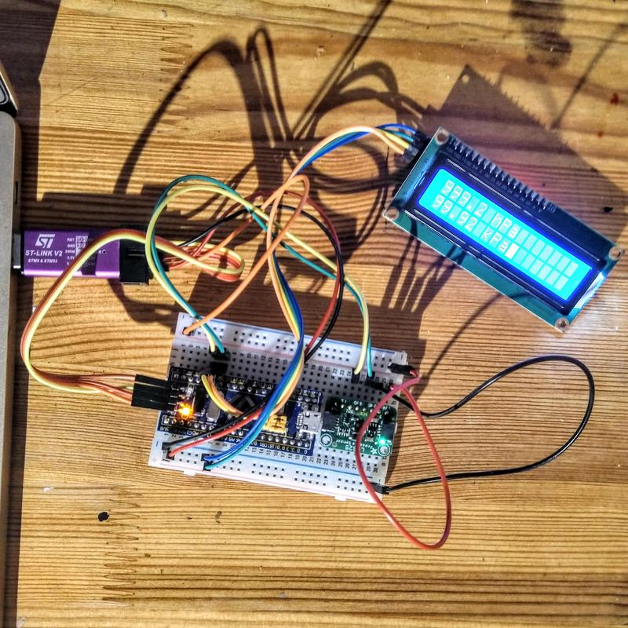

# Barometer with an LCD display

A barometer based on Adafruit's [LPS25 breakout
board](https://www.adafruit.com/product/4530), written in Rust, running on the
Blue Pill board and displaying the result on an HD44780 LCD panel.

## Description and parts

This is a barometer, it will display the current atmospheric pressure on an
16x2 alphanumeric LCD panel.

### The microcontroller

The [Blue
Pill](https://microcontrollerslab.com/stm32f103c8t6-blue-pill-pinout-peripherals-programming-features/)
is a very affordable STM32 (ARM Cortex M3) microcontroller board. You can 
read more about the Blue Pill on [stm32-base's Blue
Pill](https://stm32-base.org/boards/STM32F103C8T6-Blue-Pill) page. I have
programmed this with a clone of the [ST-Link V2 USB
dongle](https://stm32-base.org/boards/Debugger-STM32F101C8T6-STLINKV2). I've
also used the ST-Link to provide power to the whole setup as it can provide
both 5V and 3.3V power.

I use [probe-rs](https://probe.rs/) and its `probe-run` component to flash the
program onto the microcontroller and to interact with it. In order for that to
work, you must make sure the ST-Link V2 debugger runs the latest firmware,
which I did wit hthe
[STSW-LINK007](https://www.st.com/en/development-tools/stsw-link007.html)
firmware upgrade application. This is a Java app which works well on Linux.

I program the microcontroller using [Rust](https://www.rust-lang.org/). I read
[Circuit4u](https://circuit4us.medium.com/)'s [Rust on STM32F103 Blue Pill with
Probe-run
tooling](https://circuit4us.medium.com/rust-on-stm32f103-blue-pill-with-probe-run-tooling-b596f0623091)
article on using Rust on the Blue Pill. They've also got a
[blue_pill_base](https://cgit.pinealservo.com/BluePill_Rust/blue_pill_base) git
repo that I cloned as the base for working in Rust with the Blue Pill. This
sets up the `probe-rs` integration and more.

### The sensor

The barometer is built with Adafruit's [LPS25 breakout
board](https://www.adafruit.com/product/4530), which contains ST's
[LPS25H](https://www.st.com/en/mems-and-sensors/lps25h.html) MEMS pressure
sensor. It measures ambient pressure between 260-1260 hPa and can be read over
I2C.

The [lps25hb](https://crates.io/crates/lps25hb) crate is our Rust driver for
this sensor.

### The display

The display is an LCD panel displaying 16 characters on each of 2 rows and is
addressed over I2C. It has a [Hitachi HD44780 LCD
controller](https://en.wikipedia.org/wiki/Hitachi_HD44780_LCD_controller), and
an I2C backpack already soldered on. The device is sold by Handsontec as the
[I2C Serial Interface 1602 LCD
Module](http://www.handsontec.com/dataspecs/module/I2C_1602_LCD.pdf). There are
many compatible devices like this, sold under different names.

The IC on the backpack is a
[PCF8574T](https://www.nxp.com/docs/en/data-sheet/PCF8574_PCF8574A.pdf) - an
NXP version of a TI port expander chip. It is communicated with over I2C and
controls a larger number of pins. 

I use the [hd44780-driver](https://crates.io/crates/hd44780-driver) crate to
control the screen. It even includes the ability to use the I2C backpack,
making this very simple.

## Wiring

You can see the wiring diagram below for how everything is connected.

First you need to connect up your programmer/debugger to the Blue Pill (see
[connecting your
debugger](https://stm32-base.org/guides/connecting-your-debugger) for a pin-out
diagram). For more information on the exact programmer I have used - look at
the "ST-LINK/V2 Clone" section.

I'm using the first I2C bus on the Blue Pill, which is made up of pins SCL1 and
SDA1. These are labeled PB6 and PB7 on the board. You can see the pinout
diagram and chart on microcontrollerslab.com's [Blue Pill pinout - peripherals
programming
features](https://microcontrollerslab.com/stm32f103c8t6-blue-pill-pinout-peripherals-programming-features/)
article.

These I2C pins are connected to both the pressure sensor and the screen. Both
devices have their own I2C address and will happily talk on the same I2C bus.

You can see how to connect the Adafruit LPS25 in the [LPS25 pressure sensor
pinouts](https://learn.adafruit.com/adafruit-lps25-pressure-sensor/pinouts)
article on adafruit.com, and in the wiring diagram below. Adafruit describes
the pins on the LPS25 like this:

* SCK - I2C clock pin, connect to your microcontroller's I2C clock line. This
  pin is level-shifted so you can use 3-5V logic, and there's a 10K pullup on
  this pin.
* SDI - I2C data pin, connect to your microcontroller's I2C data line. This pin
  is level shifted so you can use 3-5V logic, and there's a 10K pullup on this
  pin.

The equivalent pins on the display board are called SCL (clock) and SDA (data).

For the clock signal, there should be a connection between:

* PB6 (SCL1) on the Blue Pill.
* SCK on the LPS25.
* SCL on the display.

For the I2C data line, there should be a connection between:

* PB7 (SDA1) on the Blue Pill.
* SDI on the LPS25.
* SDA on the display board.

One slightly tricky thing in this build is that the Blue Pill and the LPS25 run
on 3.3V, but the display requires 5V to work fully. Fortunately the ST-Link V2
has both pins for 3.3V and 5V, making this easy. As you can see in the diagram
below - I have one rail on the breadboard connected to 3.3V and one to 5V. The
5V rail is then connected to VCC on the display, while the 3.3V rail is
connected to VIN on the LPS25.

The diagram below tries to show the different power levels as two different
inputs, but they're actually both coming from the ST-Link - just one rail is
connected to a 3.3V pin, and the other to a 5V pin. Everything is connected to
the same GND pin on the programmer.

Note that the display backpack has a potentiometer for contrast on the back. If
you don't see any text displayed - try adjusting that potentiometer.

## Shared-bus

An important part of this build is the
[shared-bus](https://crates.io/crates/shared-bus) crate, which let me control
multiple I2C devices on one bus, like the pressure sensor and the screen.

This does all the locking and ownership management that makes sure that Rust is
happy with me sharing the I2C pins between multiple devices.

## Running the barometer

Run the barometer with:

    cargo run --bin lps25_barometer --release
